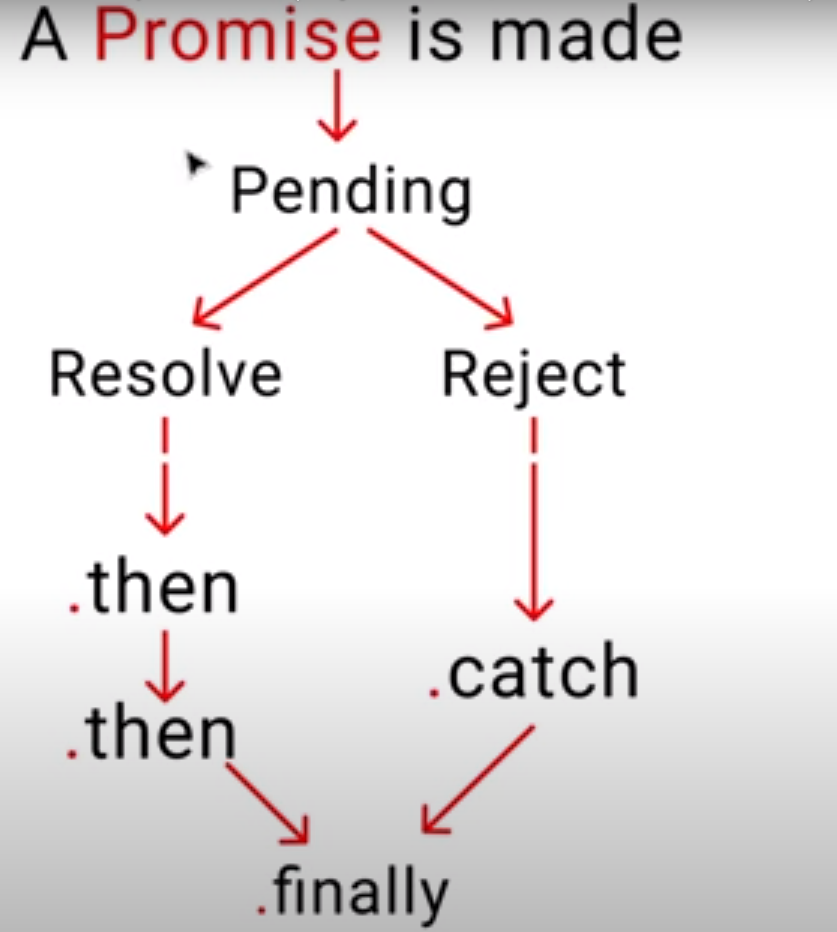

# Asynchronous programming in JS
---
## what is synchronous and asynchronous programming?
### Synchronous Programming
- As the name suggests, the tasks under sync. programming will be executed one by one.
- Execution of a task is dependent on the previous task.
- Any error in a task will break the chain of tasks
- In **javascript** tasks are executed **synchronously** by default.

### Asynchronous Programming
- In async. programming tasks are independent of each other.
- Execution of a task is **NOT** dependent on other tasks.
- Javascript use **callback queue** to perform async. tasks.
- There are many ways to perform async programming in js such as:
    - Callbacks
    - Promises
    - `async` and `await` keywords

## Promises in javascript
- Promises is one of the way to perform async. programming in js.
- We have to understand **promise lifecycle** to understand promises completely.

### Promise Lifecycle

    

- **Pending State:** It is the initial state of a promise.
    - This means that promise is not started executing, it is neither resolved nor rejected.
- **Resolve:** This means promise is **resolved** successfully and is getting executed safely
- **Reject:** This state reflects an error during execution of promise. Error handler will be invoked when an error occurs.

#### Handlers in promises
- **.then** helps in chaining multiple promises and helps executing them one after another
- **.catch** this block is invoked whenever an error is encountered. It is also called **error handler**.
- **.finally** It will get executed irrespective of the execution of promise. Resolving or rejection of a promise don't effect execution of finally block.
